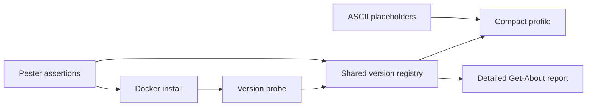

# Phellams Automator Repository Knowledge

This document records reusable PowerShell automation, container, TUI, testing, and source-control practices derived from the Phellams Automator repository.

## Scope and Evidence

The guidance is based on the following repository areas:

- `includes/Microsoft.PowerShell_profile.ps1`
- `scripts/Get-About.ps1`
- `scripts/Generate-Badge.ps1`
- `phellams-automator.dockerfile`
- `phellams-automator-local-builder.ps1`
- `tests/ProfileBanner.Tests.ps1`
- `tests/AsciiTokenizer.Tests.ps1`
- `.gitlab-ci.yml`
- `includes/modules/*`

The recommendations below distinguish established repository patterns from follow-up risks that should be addressed before copying the pattern into another project.

## Runtime and Startup Architecture

### Compact startup, detailed diagnostics on demand

The PowerShell profile keeps shell startup compact and delegates the detailed environment report to `Get-About`. The profile dot-sources `scripts/Get-About.ps1`, requests the shared registry with `Get-About -ReturnVersions`, and renders only the minimal banner during normal startup.

This gives the runtime two explicit modes:

1. Startup mode: low-output, low-work banner suitable for interactive shells and CI logs.
2. Diagnostic mode: complete binary and module inventory through `Get-About` or its `About` alias.

Do not independently probe every binary in both paths. Resolve versions once, pass the registry to the presentation layer, and keep rendering separate from discovery.

```powershell
# includes/Microsoft.PowerShell_profile.ps1
$resolvedVersions = try { Get-About -ReturnVersions } catch { [ordered]@{} }

# scripts/Get-About.ps1
function Get-About {
    param([switch]$ReturnVersions)
    # Resolve the registry once, then either return it or render it.
}
```

### Portable path resolution

The profile uses `[System.IO.Path]::Combine()` and `[System.IO.File]::Exists()` with container and repository fallbacks. This is the correct pattern for files copied into `/root/.config/powershell` while still supporting execution directly from a checkout.

Use the same fallback sequence for every copied runtime asset:

1. Check the installed/configured path.
2. Fall back to the repository-relative path.
3. Fail with an explicit diagnostic or return `Unknown`; do not silently use an unrelated working directory.

## Version Registry and Binary Probing

`scripts/Get-About.ps1` models binaries and modules as version specifications containing a stable key, type, command or module name, and a normalizer. This is preferable to scattering command probes throughout the profile.

Key rules:

- Use stable registry keys such as `pnpm`, `yarn`, `hugo`, and `photino`.
- Normalize command output before display so `v1.2.3`, `1.2.3`, prereleases, and tool-specific prefixes have a consistent representation.
- Treat an unavailable optional tool as `Unknown`, not as a fatal startup error.
- Keep command probes isolated so one failed tool does not suppress the entire report.
- Maintain parity between the registry, the ASCII template placeholders, the profile lookup table, Docker installation, and Pester assertions.

The four-way parity check is important:



Adding a binary requires updating all relevant nodes, not only the Dockerfile.

## TUI and ANSI Rendering

### Calculate layout before color encoding

The repository’s TUI code uses plain text tokenization, calculated box widths, and a `StringBuilder` before injecting ANSI escape sequences. This is required because ANSI sequences occupy bytes but no terminal columns.

Correct order:

1. Read or tokenize raw text.
2. Calculate printable widths, truncation, padding, and borders.
3. Construct the uncolored row or box.
4. Apply ANSI foreground/background sequences.
5. Emit the completed output.

Never calculate `.Length` after adding `ESC[...m` sequences. Never prepend a label to a complete multi-line box without applying the same horizontal offset to every border line.

### Centralize palette and structural glyphs

Keep color definitions and UI characters separate from layout logic. The repository uses a reusable ANSI tokenizer and color helpers; the same separation should be applied to future dashboards and progress displays.

- Palette: ANSI reset, indexed-256 colors, TrueColor colors, and semantic names.
- UI: corners, horizontal rules, vertical rules, separators, and status glyphs.
- Renderer: width calculations, rows, columns, gradients, and output.

Use ordinary ASCII or stable box-drawing glyphs in fixed-width layouts. Emoji, combining characters, private-use Nerd Font glyphs, and ambiguous-width arrows can break alignment across terminal hosts.

### CI color fallback

The repository detects GitLab CI and uses xterm-256 output instead of assuming TrueColor support. Preserve this behavior in any renderer that emits gradients:

```powershell
$gradientColorMode = if ([string]::IsNullOrEmpty($env:GITLAB_CI)) {
    'TrueColor'
} else {
    'Indexed256'
}
```

Do not hard-code TrueColor output in logs that may be rendered by GitLab, redirected files, or basic terminal emulators.

## PowerShell Performance Rules

The repository and skill references support the following implementation rules for high-frequency or large-input paths:

- Prefer `[System.IO.File]::ReadAllText()` and `WriteAllText()` for whole-file operations.
- Prefer `[System.IO.Path]::Combine()` for portable paths.
- Use `[System.Text.StringBuilder]` for repeated string assembly.
- Use `List[T]`, `Queue[T]`, or `HashSet[T]` instead of `$array += $item`.
- Use `foreach` instead of `Where-Object` or `ForEach-Object` inside animation and rendering loops.
- Use `begin`, `process`, and `end` blocks for streaming pipeline cmdlets.
- Dispose streams, readers, responses, and other `IDisposable` objects in `finally` blocks.
- Use `Set-StrictMode -Version Latest` and `$ErrorActionPreference = 'Stop'` in production scripts.

The repository demonstrates `List[string]` for compact banner entries and `StringBuilder` for SVG and TUI output. It also shows where older helper code still uses `Get-Content`, `Set-Content`, `Join-Path`, and pipeline filters; these are acceptable for low-volume compatibility code but should not be copied into hot paths without measurement.

## Module Structure

The vendored modules under `includes/modules` provide a practical module layout:

- A root `.psm1` controls loading and exports.
- A `.psd1` defines metadata and exported commands.
- Cmdlets and helpers are kept in separate files where the module supports that structure.
- Internal helper functions should not be exported.

For new modules, use a root loader, explicit `Export-ModuleMember`, file-per-cmdlet public commands, and separate private/helper directories. Add comment-based help with `Synopsis`, `Description`, `Parameters`, `Examples`, and `Notes` for every public cmdlet.

## Local Builder and Container Contract

The local builder is part of the development contract, not an incidental convenience script. Its accepted modes must match its switch branches, Dockerfiles, image tags, and README examples.

Recommended contract:

- Validate the build mode with `ValidateSet`.
- Build the selected image with `docker buildx build`.
- Run a post-build smoke test against the exact tag that was built.
- Use the same commands in local smoke tests and CI image tests.
- Avoid mutating source assets as a side effect unless the mutation is explicit and reversible.
- Keep cleanup operations narrowly scoped to the project image tag.

The current repository has historical drift between builder mode names, comments, and switch branches. Before extending the builder, reconcile `ValidateSet`, `Switch`, default help text, README instructions, and available Dockerfiles as one change.

## Docker Toolchain Parity

The Dockerfile is the executable source of truth for the image manifest. Every installed tool should have three corresponding records:

1. Installation command.
2. Final verification command.
3. Documentation/profile registry entry.

For example, adding Hugo, Dart, pnpm, or Yarn requires updating the install layer, the final sanity check, `Get-About`, the profile registry, the ASCII template, README image manifest, and tests where applicable.

Keep independent toolchain families in separate layers when they have different repositories, signing keys, or failure modes. Clean package lists and temporary files at the end of each layer. Pin versions where reproducibility matters; clearly mark rolling packages in documentation.

## Testing and CI/CD

The repository uses Pester tests for both static contract checks and behavior checks:

- Static checks verify required functions, aliases, placeholders, paths, and registry keys.
- Behavioral checks verify TrueColor and Indexed256 output, including GitLab CI behavior.
- Environment variables are saved and restored in `try/finally` blocks.
- Tests use repository-relative paths resolved with `[System.IO.Path]::Combine()`.

The GitLab pipeline follows a build, test, deploy, and notify sequence. The build publishes an image tagged by commit SHA; the test job consumes that exact image; deployment generates a semantic version from full Git history and promotes the tested image. Preserve this artifact identity chain:

```text
source commit -> image:$CI_COMMIT_SHA -> test image:$CI_COMMIT_SHA -> promote same image -> semantic release tags
```

Set `GIT_DEPTH: 0` when semantic version calculation depends on commit history. Treat credentials as CI variables and always log out after registry operations.

## Source-Control Safety

This repository exposed a critical Git workflow lesson: `HEAD`, the index, and the working tree can contain different snapshots. A commit workflow must inspect all three explicitly before staging.

Use this diagnostic sequence before committing:

```bash
# Current checkout and branch
git status --short
git log -5 --oneline --decorate

# Working-tree edits versus index
git diff --stat

# Index edits versus HEAD
git diff --cached --stat

# Combined checkout state versus HEAD
git diff HEAD --stat
```

Do not assume `git add -A` is safe when files already show `MM`. First inspect the unstaged and staged diffs separately. Never restore a file from an older branch or commit merely because it resembles the desired version. If staged and unstaged snapshots represent separate legitimate changes, preserve both deliberately and verify the final commit contents with `git show --stat` and `git status --short`.

## Follow-up Risks Identified

These are repository-specific checks to perform before treating the patterns as production defaults:

- Reconcile local-builder mode names and cleanup behavior.
- Ensure every Dockerfile package is present in the final sanity check and documentation.
- Validate Dockerfile shell syntax after changing a package install layer; an `apt install` token inside another package list is invalid intent.
- Avoid relying on rolling package versions when image reproducibility is required.
- Add a direct Pester invocation to CI so the repository tests run independently of image smoke tests.
- Replace low-volume legacy path and content cmdlets incrementally, prioritizing hot paths rather than applying blanket rewrites.

## API and Configuration Reference

| Area | Repository contract | Default or constraint | Evidence |
| --- | --- | --- | --- |
| Startup report | Compact profile banner | Detailed report is opt-in | `includes/Microsoft.PowerShell_profile.ps1` |
| Detailed report | `Get-About`, alias `About` | `-ReturnVersions` returns the shared registry | `scripts/Get-About.ps1` |
| Color mode | TrueColor locally, Indexed256 in GitLab CI | Select from `GITLAB_CI` | `tests/AsciiTokenizer.Tests.ps1` |
| Version registry | Stable binary/module keys | Missing tools resolve to `Unknown` | `scripts/Get-About.ps1` |
| Local build | Docker Buildx plus smoke test | Mode names must match `ValidateSet` and `Switch` | `phellams-automator-local-builder.ps1` |
| Image identity | Commit-SHA image tag | Test and deploy the same image | `.gitlab-ci.yml` |
| Git history | Full history for semver | `GIT_DEPTH: 0` | `.gitlab-ci.yml` |
| Tests | Pester static and behavioral tests | Restore environment variables in `finally` | `tests/*.Tests.ps1` |
| File paths | .NET path APIs | Avoid hard-coded separators | Profile and test files |
| TUI layout | Raw width first, ANSI last | Never pad encoded strings | `scripts/Get-About.ps1` and tokenizer tests |
