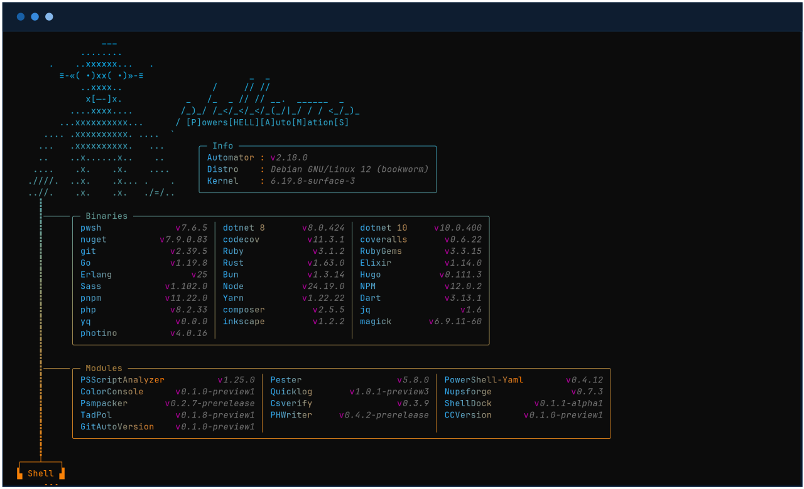

<div align="center">


# **Phellams-Automator**

![Static Badge][license-badge] [![arc][arc-version]][arc-url] [![docker][docker-version]][docker-url] ![docker][docker-size] ![docker][docker-pulls] [![build][build-status]][build-url] ![runtime][runtime-badge]

## **About The Project**

**Phellams-Automator** is a multi-language build environment based on _Debian 12 slim_. It integrates with the [Automator-Devops](https://gitlab.com/phellams/Automator-Devops) suite and can also be used as a standalone CI/CD runner image.



</div>

---

## **Features & Capabilities**

### **Automation Toolchain**

- **PowerShell Pipeline:** Automated module packaging into directory structures, `.zip` archives, or `.nupkg` artifacts via **Psmpacker**.
- **Version Management:** Automated Semantic Versioning orchestration via **GitAutoVersion**.
- **Documentation Engine:** Native man-page and help-file generation via **Phwriter**.
- **Integrity Verification:** Automated checksum generation and verification via **CSVerify**.

### **Multi-Language Build Systems**

- **.NET:** Native execution support for `dotnet build` and `dotnet pack` targetting SDK v8 and v10 (including AOT compilation targets).
- **Package Management:** Native `nuget pack` capabilities coupled with custom **Nupsforge** cmdlets for multi-repository distribution (GitLab, Chocolatey, ProGet).
- **JavaScript / TypeScript:** Native execution through **Bun**, **Node.js**, **npm**, **pnpm**, and **Yarn**.
- **Systems Languages:** Built-in toolchains for **Rust**, **Go**, **Elixir**, and **Erlang/OTP**.
- **Dart:** Dart SDK support for Dart application and package workflows.
- **Ruby / Jekyll:** Optimized runner configuration featuring integrated **Bundler** with CI hardening policies:
- Overridden `BUNDLE_SILENCE_ROOT_WARNING: "1"`
- Enforced deterministic dependency pathing via `BUNDLE_PATH: "vendor/bundle"`
- Pre-baked system dependencies (`ruby-dev`, `build-essential`) to eliminate runtime compilation failures.

### **CI/CD & DevOps Integration**

- Native optimization for **GitLab CI** execution runners.
- Pre-configured, zero-dependency coverage upload targets for **Codecov** and **Coveralls**.

### **Feature Matrix & Roadmap**

| Capability                 | Component / Runtime                         |
| -------------------------- | ------------------------------------------- |
| **PowerShell Core**        | Module packaging, testing, and distribution |
| **.NET Toolchain**         | Compilation, packing, and AOT support       |
| **Bun Runtime**            | JavaScript and TypeScript execution         |
| **Node.js Runtime**        | Node.js and npm                             |
| **Inkscape & ImageMagick** | Media conversion and export                 |
| **DevOps Pipelines**       | Codecov and Coveralls clients               |
| **PHP 8 Ecosystem**        | PHP, Composer, and Xdebug                   |
| **Python Runtime**         | Python 3 runtime                            |

---

## **Image Manifest**

### **System Binaries**

- **[.NET SDK v8.0.424 and v10.0.400](https://dot.net)**
- **[PowerShell Core v7.6.5](https://github.com/PowerShell/PowerShell)**
- **[Bun Runtime v1.3.14](https://bun.sh)**
- **[Node.js v24.19.0](https://nodejs.org)** and **npm v12.0.2**
- **[pnpm v11.22.0](https://pnpm.io)** and **[Yarn v1.22.22](https://yarnpkg.com)**
- **[NuGet v7.9.0.83](https://www.nuget.org/)** _(via Mono)_
- **[Go Compiler v1.19.8](https://go.dev)**
- **[Rust Toolchain v1.63.0](https://www.rust-lang.org)**
- **[Elixir Runtime v1.14.0](https://elixir-lang.org)**
- **[Erlang/OTP v25](https://www.erlang.org)**
- **[Dart SDK v3.13.1](https://dart.dev)**
- **[Hugo v0.111.3](https://gohugo.io)** and **[Dart Sass v1.102.0](https://sass-lang.com)**
- **[Ruby & Jekyll](https://www.ruby-lang.org)** _(with hardened Bundler toolset)_
- **[PHP v8.2.33 & Composer v2.5.5](https://www.php.net/)** _(Native PHP8 runtime & package manager)_
- **[ImageMagick & Inkscape](https://imagemagick.org)** _(Media conversion & high-fidelity graphics)_
- **[jq & yq](https://jqlang.github.io/jq/)** _(JSON & YAML processors)_
- **[Photino.NET](https://www.tryphotino.io)** _(Pre-cached .NET lightweight GUI desktop runtime)_
- **[Codecov / Coveralls CLI](https://codecov.io)**

_Versions reflect the current image build; packages installed from rolling repositories may change on rebuild._

### **Pre-Baked PowerShell Modules**

- **Pester** & **PSScriptAnalyzer** _(Testing & Static Analysis)_
- **PowerShell-Yaml** _(Data Serialization)_
- **ColorConsole** & **Quicklog** _(UI Layout & High-Performance Logging)_
- **Tadpol** _(Runspace Progress Bars & Spinners)_
- **ShellDock** _(Isolated Runspace Executor)_
- **Nupsforge**, **Psmpacker**, **CSVerify**, **GitAutoVersion** _(Core Build Stack)_

---

## **Build and Local Usage**

### **Building the Image Locally**

Build the image from the repository root:

```bash
# Repository root (Bash, Zsh, or WSL)
docker buildx build --load \
  --tag phellams-automator:localbuild \
  --file phellams-automator.dockerfile \
  .
```

The `--load` option makes the result available to `docker run` when the selected
Buildx driver does not load images automatically.

Alternatively, use the local PowerShell builder:

```powershell
# Repository root (PowerShell 7)
./phellams-automator-local-builder.ps1 -BuildMode Base
```

### **Image Information**

The image starts PowerShell when no command is supplied:

```bash
# Bash, Zsh, or WSL
docker run --rm docker.io/sgkens/phellams-automator:latest
```

Print the installed runtime and module information:

```bash
# Bash, Zsh, or WSL
docker run --rm docker.io/sgkens/phellams-automator:latest \
  pwsh -NoProfile -Command \
  'Get-Module -ListAvailable | Sort-Object Name, Version | Format-Table Name, Version'
```

### **Mounting the Current Project**

Use `/workspace` as the container path and set it as the working directory:

```bash
# Bash, Zsh, or WSL
docker run --rm --interactive --tty \
  --volume "$(pwd):/workspace" \
  --workdir /workspace \
  docker.io/sgkens/phellams-automator:latest
```

```powershell
# Windows, macOS, or Linux PowerShell
docker run --rm --interactive --tty `
  --volume "${PWD}:/workspace" `
  --workdir /workspace `
  docker.io/sgkens/phellams-automator:latest
```

Docker Desktop must have WSL integration enabled when these commands are run
from a WSL distribution.

### **Running a Project Script**

```bash
# Bash, Zsh, or WSL
docker run --rm \
  --volume "$(pwd):/workspace" \
  --workdir /workspace \
  docker.io/sgkens/phellams-automator:latest \
  pwsh -NoProfile -File ./myscript.ps1
```

### **PowerShell Test and Build Commands**

PowerShell cmdlets must be passed to `pwsh -Command`; they are not standalone
Linux executables.

```bash
# Run all Pester tests below ./tests
docker run --rm \
  --volume "$(pwd):/workspace" \
  --workdir /workspace \
  docker.io/sgkens/phellams-automator:latest \
  pwsh -NoProfile -Command 'Invoke-Pester -Path ./tests'

# Analyze all PowerShell files in the project
docker run --rm \
  --volume "$(pwd):/workspace" \
  --workdir /workspace \
  docker.io/sgkens/phellams-automator:latest \
  pwsh -NoProfile -Command 'Invoke-ScriptAnalyzer -Path . -Recurse'

# Return the GitAutoVersion version
docker run --rm \
  --volume "$(pwd):/workspace" \
  --workdir /workspace \
  docker.io/sgkens/phellams-automator:latest \
  pwsh -NoProfile -Command '(Get-GitAutoVersion).Version'

# Return a version calculated from Conventional Commits
docker run --rm \
  --volume "$(pwd):/workspace" \
  --workdir /workspace \
  docker.io/sgkens/phellams-automator:latest \
  pwsh -NoProfile -Command 'Get-ConventionalCommitVersion'
```

The bundled custom modules export the following commands:

| Module                      | Exported commands                                                                                       |
| --------------------------- | ------------------------------------------------------------------------------------------------------- |
| `ColorConsole`              | `New-ColorConsole`, `Write-Color`                                                                       |
| `ConventionalCommitVersion` | `Get-ConventionalCommitVersion`                                                                         |
| `CSVerify`                  | `New-CheckSum`, `New-VerificationFile`, `Read-CheckSum`, `Test-Verification`                            |
| `GitAutoVersion`            | `Get-GitAutoVersion`                                                                                    |
| `Nupsforge`                 | `New-ChocoNuspecFile`, `New-ChocoPackage`, `New-NupkgIcon`, `New-NupkgPackage`, `New-NuspecPackageFile` |
| `PHWriter`                  | `New-PHWriter`, `Write-PHAsciiLogo`                                                                     |
| `Psmpacker`                 | `Build-Module`                                                                                          |
| `Quicklog`                  | `Get-QuicklogTypes`, `New-Quicklog`, `Write-Quicklog`, `Write-QuicklogProgress`                         |
| `ShellDock`                 | `New-ShellDock`                                                                                         |
| `Tadpol`                    | `Clear-Prelines`, `Get-TPThemes`, `New-TPObject`, `Write-TPProgress`                                    |

Inspect a command's syntax and examples before using it:

```bash
# Replace Build-Module with any exported command listed above
docker run --rm docker.io/sgkens/phellams-automator:latest \
  pwsh -NoProfile -Command 'Get-Help Build-Module -Full'
```

### **Native Toolchain Commands**

All examples mount the current project at `/workspace`.

```bash
# .NET
docker run --rm -v "$(pwd):/workspace" -w /workspace \
  docker.io/sgkens/phellams-automator:latest dotnet build

# NuGet
docker run --rm -v "$(pwd):/workspace" -w /workspace \
  docker.io/sgkens/phellams-automator:latest nuget pack ./package.nuspec

# Bun
docker run --rm -v "$(pwd):/workspace" -w /workspace \
  docker.io/sgkens/phellams-automator:latest bun test

# Node.js and npm
docker run --rm -v "$(pwd):/workspace" -w /workspace \
  docker.io/sgkens/phellams-automator:latest npm test

# pnpm and Yarn
docker run --rm -v "$(pwd):/workspace" -w /workspace \
  docker.io/sgkens/phellams-automator:latest pnpm install
docker run --rm -v "$(pwd):/workspace" -w /workspace \
  docker.io/sgkens/phellams-automator:latest yarn install

# Go
docker run --rm -v "$(pwd):/workspace" -w /workspace \
  docker.io/sgkens/phellams-automator:latest go test ./...

# Rust
docker run --rm -v "$(pwd):/workspace" -w /workspace \
  docker.io/sgkens/phellams-automator:latest rustc --version

# Elixir
docker run --rm -v "$(pwd):/workspace" -w /workspace \
  docker.io/sgkens/phellams-automator:latest elixir --version

# Erlang/OTP
docker run --rm -v "$(pwd):/workspace" -w /workspace \
  docker.io/sgkens/phellams-automator:latest erl -noshell -eval 'io:format("~s~n", [erlang:system_info(otp_release)]), halt().'

# Dart
docker run --rm -v "$(pwd):/workspace" -w /workspace \
  docker.io/sgkens/phellams-automator:latest dart --version

# Ruby and Jekyll
docker run --rm -v "$(pwd):/workspace" -w /workspace \
  docker.io/sgkens/phellams-automator:latest bundle exec jekyll build

# PHP and Composer
docker run --rm -v "$(pwd):/workspace" -w /workspace \
  docker.io/sgkens/phellams-automator:latest composer install

# Inkscape
docker run --rm -v "$(pwd):/workspace" -w /workspace \
  docker.io/sgkens/phellams-automator:latest \
  inkscape ./image.svg --export-filename=./image.png

# ImageMagick
docker run --rm -v "$(pwd):/workspace" -w /workspace \
  docker.io/sgkens/phellams-automator:latest \
  convert ./image.png -resize 50% ./image-small.png

# jq and yq
docker run --rm -v "$(pwd):/workspace" -w /workspace \
  docker.io/sgkens/phellams-automator:latest jq . ./data.json
docker run --rm -v "$(pwd):/workspace" -w /workspace \
  docker.io/sgkens/phellams-automator:latest yq . ./data.yaml

# Codecov and Coveralls
docker run --rm -v "$(pwd):/workspace" -w /workspace \
  docker.io/sgkens/phellams-automator:latest codecov --help
docker run --rm -v "$(pwd):/workspace" -w /workspace \
  docker.io/sgkens/phellams-automator:latest coveralls --help
```

### **Automation Script Parameters**

`phellams-automator-local-builder.ps1` accepts one mandatory parameter:

| Parameter    | Type   | Accepted values | Description                                                     |
| ------------ | ------ | --------------- | --------------------------------------------------------------- |
| `-BuildMode` | String | `Base`, `choco` | Selects the Dockerfile and local image tag used by the builder. |

---

## **Contributing & License**

### **Contributing**

1. Fork the Project.
2. Create your Feature Branch (`git checkout -b feature/AmazingFeature`).
3. Commit your Changes (`git commit -m 'feat: Add AmazingFeature'`).
4. Push to the Branch (`git push origin feature/AmazingFeature`).
5. Open a **Merge Request**.

### **License**

Distributed under the **MIT License**. See `LICENSE` for more information.

---

[phellams-logo-link]: https://raw.githubusercontent.com/phellams/phellams-general-resources/main/logos/phellams/dist/png/phellams-logo-16x16.png
[commitfusion-logo-link]: https://raw.githubusercontent.com/phellams/phellams-general-resources/main/logos/commitfusion/dist/png/commitfusion-logo-16x16.png
[arc-version]: https://img.shields.io/badge/Debian-12.13_slim-cyan?logo=ubuntu&color=%232D2D34&labelcolor=red&style=flat
[arc-url]: https://hub.docker.com/r/sgkens/phellams-automator
[docker-version]: https://img.shields.io/docker/v/sgkens/phellams-automator?style=flat&logo=docker&logoColor=%233478BD&logoSize=auto&labelColor=%232D2D34&color=%23446878
[docker-url]: https://hub.docker.com/r/sgkens/phellams-automator/tags
[docker-size]: https://img.shields.io/docker/image-size/sgkens/phellams-automator?style=flat&logo=docker&logoColor=%233478BD&logoSize=auto&labelColor=%232D2D34&color=%23446878
[docker-pulls]: https://img.shields.io/docker/pulls/sgkens/phellams-automator?style=flat&logo=docker&logoColor=%233478BD&logoSize=auto&labelColor=%232D2D34&color=%23446878
[build-status]: https://img.shields.io/gitlab/pipeline-status/phellams%2Fphellams-automator?style=flat&logo=Gitlab&logoColor=%233478BD&labelColor=%232D2D34
[build-url]: https://gitlab.com/phellams/phellams-automator/-/pipelines
[license-badge]: https://img.shields.io/badge/License-MIT-Blue?style=flat&labelColor=%232D2D34&color=%2317202a
[runtime-badge]: https://gitlab.com/api/v4/projects/phellams%2Fphellams-automator/jobs/artifacts/main/raw/runtime-badge-flat.svg?job=generate-runtime-badge
