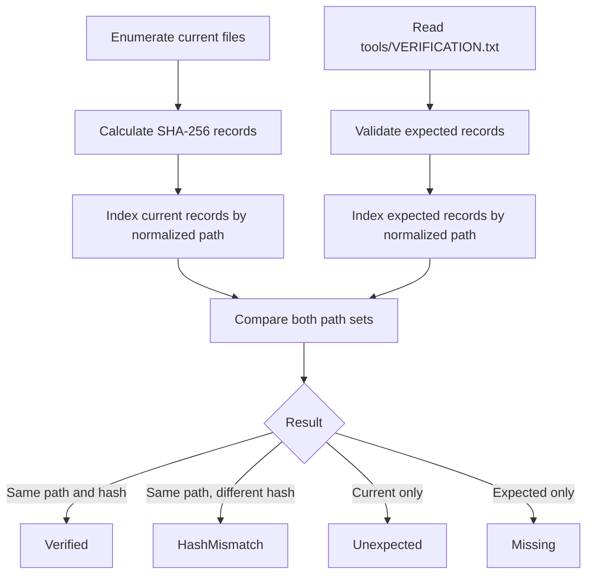

# csverify

csverify is a PowerShell 7 module that generates, parses, and validates path-bound SHA-256 records stored in a legacy `VERIFICATION.txt` manifest.

## Requirements

### Conceptual

The module is intended for package builds, source distributions, and automation workflows that need to detect modified, missing, or unexpected files. It has no required PowerShell module dependencies at runtime.

### Strict Reference

| Requirement | Value |
| --- | --- |
| PowerShell | 7.0 or later |
| Operating systems | Windows, Linux, macOS |
| Default algorithm | SHA-256 |
| Manifest location used by `Test-Verification` | `<package-root>/tools/VERIFICATION.txt` |
| Current tagged version | `0.3.8` |
| Runtime module dependencies | None |

## Installation

### PowerShell Gallery

```powershell
# PowerShell 7
Install-Module -Name csverify -Scope CurrentUser
Import-Module -Name csverify
```

### Chocolatey

```powershell
# Windows PowerShell or PowerShell 7 running as required by Chocolatey
choco install csverify
Import-Module -Name csverify
```

### Repository Checkout

```powershell
# PowerShell 7
git clone https://gitlab.com/phellams/csverify.git
Set-Location ./csverify
Import-Module ./csverify.psd1 -Force
```

Release artifacts and packages are available from:

- [GitLab releases](https://gitlab.com/phellams/csverify/-/releases)
- [GitLab packages](https://gitlab.com/phellams/csverify/-/packages)
- [PowerShell Gallery](https://www.powershellgallery.com/packages/csverify)
- [Chocolatey Community Repository](https://community.chocolatey.org/packages/csverify)

## Verification Model

### Conceptual

Directory records are identified by normalized relative path. The hash is a property of the file at that path; it is not a unique record identifier. Different paths may contain identical bytes and therefore share the same hash.

Verification compares both path sets:

- A path in both sets with the same hash is `Verified`.
- A path in both sets with a different hash is `HashMismatch`.
- A current path absent from the manifest is `Unexpected`.
- A manifest path absent from disk is `Missing`.

Every non-verified state causes `Test-Verification` to throw a terminating error after comparison.

### Strict Reference



Checksums establish byte consistency with the supplied manifest. If an attacker can replace both an artifact and its checksum manifest, matching checksums do not establish publisher authenticity. Obtain manifests through a trusted channel or combine checksum verification with an independently trusted signature.

## Quick Start

### Generate a Manifest String

`New-CheckSum` returns the complete legacy manifest as a string and does not write a file.

```powershell
# PowerShell 7, repository or package root
$manifest = New-CheckSum -Path './dist/package'
$manifest | Set-Content -LiteralPath './checksums-preview.txt' -Encoding utf8NoBOM
```

### Create `tools/VERIFICATION.txt`

Both directories must already exist. The command supports `-WhatIf` and replaces the destination file when execution is approved.

```powershell
# PowerShell 7, project root
$PACKAGE_ROOT = [System.IO.Path]::GetFullPath('./dist/package')
$TOOLS_ROOT = [System.IO.Path]::Combine($PACKAGE_ROOT, 'tools')
[System.IO.Directory]::CreateDirectory($TOOLS_ROOT) | Out-Null

New-VerificationFile -RootPath $PACKAGE_ROOT -OutputPath $TOOLS_ROOT
```

### Read a Manifest

Returned records contain raw strings and no ANSI escape sequences.

```powershell
# PowerShell 7
$records = Read-CheckSum -File './dist/package/tools/VERIFICATION.txt'
$records | Select-Object Size, Hash, Path
```

A manifest can also be parsed from an in-memory string:

```powershell
# PowerShell 7
$manifest = New-CheckSum -Path './dist/package'
$records = Read-CheckSum -FromString $manifest
$records | ConvertTo-Json -Depth 3
```

### Verify a Package Tree

`Path` is the package root, not the path to `VERIFICATION.txt`.

```powershell
# PowerShell 7
$results = Test-Verification -Path './dist/package'
$results | Format-Table Status, Path, ExpectedHash, ActualHash -AutoSize
```

On any mismatch, addition, or deletion, `Test-Verification` throws a terminating error. Use `try/catch` when the caller needs explicit failure handling:

```powershell
# PowerShell 7
try {
    $results = Test-Verification -Path './dist/package' -ErrorAction Stop
    $results | ConvertTo-Json -Depth 3
}
catch {
    Write-Error "Package verification failed: $($_.Exception.Message)"
}
```

## Manifest Format

### Conceptual

The current format contains human-readable verification instructions followed by a delimiter and one record per line. It is retained for compatibility with existing packages and Chocolatey workflows.

### Strict Reference

```text
# VERIFICATION.txt
VERIFICATION
...
-[CHECKSUM HASHES]-
___________________
0.07KB | FC6FC10FA3099F8D1346565B4AD57A4A57FAB2933C676E0B32CD4C7853B5C341 | ./module.psm1
3.16KB | 7C3178BEC3EED88F93C86F8F3ECF4356BAA3EB7559965C2BE8C20D885C057519 | ./module.psd1
```

Parser requirements:

| Field | Requirement |
| --- | --- |
| Size | Non-empty legacy display value |
| Hash | Exactly 64 hexadecimal characters |
| Path | Non-empty normalized relative path |
| Fields | Exactly three fields separated by `|` |
| Duplicate normalized path | Rejected |
| Rooted or traversal path | Rejected |

The legacy size field is display metadata and is not an exact byte count. A versioned, lossless manifest format is tracked in [devtracker-pending.md](./devtracker-pending.md).

## File Selection

### Conceptual

`New-CheckSum` recursively enumerates regular files, converts paths to a normalized `/` representation, and sorts them using ordinal comparison before hashing.

### Strict Reference

| Rule | Behavior |
| --- | --- |
| Hidden files | Included unless matched by another exclusion |
| `.git` directory segments | Excluded |
| File named `VERIFICATION.txt` | Excluded, case-insensitive |
| `.nuspec` files | Excluded, case-insensitive |
| Output ordering | Ordinal normalized relative path |
| Hash casing | Uppercase hexadecimal |
| Manifest path prefix | `./` |

## Result Objects

### Checksum Record

`Read-CheckSum` assigns the type name `CsVerify.ChecksumRecord` and returns these properties:

| Property | Type | Description |
| --- | --- | --- |
| `Size` | `System.String` | Legacy human-readable size value. |
| `Hash` | `System.String` | Validated uppercase SHA-256 digest. |
| `Path` | `System.String` | Normalized relative path prefixed with `./`. |

### Verification Result

Successful verification returns records with the type name `CsVerify.VerificationResult`:

| Property | Type | Description |
| --- | --- | --- |
| `Status` | `System.String` | `Verified`, `HashMismatch`, `Unexpected`, or `Missing`. |
| `Path` | `System.String` | Normalized relative path. |
| `Algorithm` | `System.String` | Currently `SHA256`. |
| `ExpectedHash` | `System.String` or null | Digest from the manifest. |
| `ActualHash` | `System.String` or null | Digest calculated from the current file. |
| `ExpectedSize` | `System.String` or null | Legacy manifest size value. |
| `ActualSize` | `System.String` or null | Current legacy size value. |

## Module Architecture

### Conceptual

The root module is an explicit loader. Shared PowerShell helpers are private; compiled dependencies have a separate reserved location.

### Strict Reference

```text
csverify/
|-- csverify.psd1
|-- csverify.psm1
|-- Public/
|   |-- New-CheckSum.ps1
|   |-- New-VerificationFile.ps1
|   |-- Read-CheckSum.ps1
|   `-- Test-Verification.ps1
|-- Private/
|   |-- ConvertTo-CsRelativePath.ps1
|   `-- Helpers/
|       |-- ConvertTo-CsDisplaySize.ps1
|       |-- Format-CsMessage.ps1
|       `-- New-AsciiColor.ps1
|-- Lib/
|   `-- reserved for compiled C# assemblies and DLLs
`-- test/
    `-- test-unit-pester.ps1
```

The loader imports `Private` files before `Public` files and exports only the four functions declared in both the loader and module manifest. Private helpers and legacy aliases such as `csole` are not exported.

## Build and Test

### Local Validation

```powershell
# PowerShell 7, repository root
Invoke-Pester ./test/test-unit-pester.ps1 -Output Detailed
```

Run static analysis against owned source:

```powershell
# PowerShell 7, repository root
$SOURCE_PATHS = @('./csverify.psm1') + @(
    Get-ChildItem ./Public, ./Private -Recurse -File -Filter '*.ps1' |
        Select-Object -ExpandProperty FullName
)

foreach ($SOURCE_PATH in $SOURCE_PATHS) {
    Invoke-ScriptAnalyzer -Path $SOURCE_PATH -Severity Warning, Error
}
```

### Automator Build

```powershell
# PowerShell 7, repository root; Docker required for -Automator
./automator-devops/localbuilder.ps1 -Automator -Pester -Build
```

Build and release behavior is configured in [`build_config.json`](./build_config.json). The current local suite contains 15 tests, reports 90.73% coverage for owned module source, and produces no PSScriptAnalyzer warnings or errors.

## Development Status

Current and historical changes are recorded in [CHANGELOG.md](./CHANGELOG.md). Pending checksum formats, remote release verification, Chocolatey rendering, signature validation, and provenance work are defined as epics and tasks in [devtracker-pending.md](./devtracker-pending.md).

The repository version is derived with:

```powershell
# PowerShell 7, repository root
. ../phellams-utils/helpers/semver/Get-ConventionalCommitVersion.ps1
Get-ConventionalCommitVersion | Format-List Version, LastTag, CommitsScanned, BumpType
```

The current unreleased verification fix selects a patch release from the latest tag:

```text
Version        : 0.3.9
LastTag        : v0.3.8
BumpType       : patch
```

`CommitsScanned` is intentionally omitted because it changes whenever another documentation or maintenance commit is added before release.

## Contributing

1. Branch from `develop`.
2. Make one scoped change per conventional commit.
3. Add or update Pester coverage.
4. Run tests, coverage, and PSScriptAnalyzer locally.
5. Open a merge request targeting `develop`.

Use Conventional Commit subjects such as:

```text
fix(verification): compare duplicate hashes by path
feat(manifest): add GNU checksum parser
docs(readme): document trust model
```

## License

csverify is distributed under the [MIT License](./LICENSE).

## API Reference

### `New-CheckSum`

| Member | Type | Required | Default | Description |
| --- | --- | --- | --- | --- |
| `Path` | `System.String` | Yes | None | Existing root directory to enumerate recursively. Accepts `FullName` as an alias and pipeline binding by property name. |
| Output | `System.String` | Output | None | Complete legacy verification manifest. |
| Hash algorithm | Fixed | N/A | SHA-256 | Algorithm used for every selected file. |
| Common parameters | PowerShell | No | Standard | Includes `-Verbose`, `-ErrorAction`, and related common parameters. |

### `Read-CheckSum`

| Member | Type | Required | Default | Description |
| --- | --- | --- | --- | --- |
| `File` | `System.String` | Yes in `File` set | Default parameter set | Existing legacy manifest file. |
| `FromString` | `System.String` | Yes in `String` set | None | Complete manifest content supplied in memory. |
| Output | `CsVerify.ChecksumRecord` | Output | None | Raw validated checksum records. |
| Hash validation | Fixed | N/A | 64 hexadecimal characters | Rejects malformed SHA-256 values. |

### `New-VerificationFile`

| Member | Type | Required | Default | Description |
| --- | --- | --- | --- | --- |
| `RootPath` | `System.String` | Yes | None | Existing root directory whose files are hashed. |
| `OutputPath` | `System.String` | Yes | None | Existing directory that receives `VERIFICATION.txt`. |
| Output | `CsVerify.ChecksumRecord` | Output | None | Records parsed from the file after it is written. |
| `-WhatIf` | Switch | No | False | Shows whether the destination would be created or replaced. |
| `-Confirm` | Switch | No | Host policy | Requests confirmation through PowerShell `ShouldProcess`. |

### `Test-Verification`

| Member | Type | Required | Default | Description |
| --- | --- | --- | --- | --- |
| `Path` | `System.String` | Yes | None | Existing package root containing `tools/VERIFICATION.txt`. |
| Output | `CsVerify.VerificationResult` | Output on success | None | Path-bound verification records. |
| Failure behavior | Terminating error | N/A | Enabled | Throws when any record is `HashMismatch`, `Missing`, or `Unexpected`. |
| Path comparison | Platform-aware | N/A | Windows insensitive; Linux/macOS ordinal | Dictionary comparer used for normalized record identity. |
